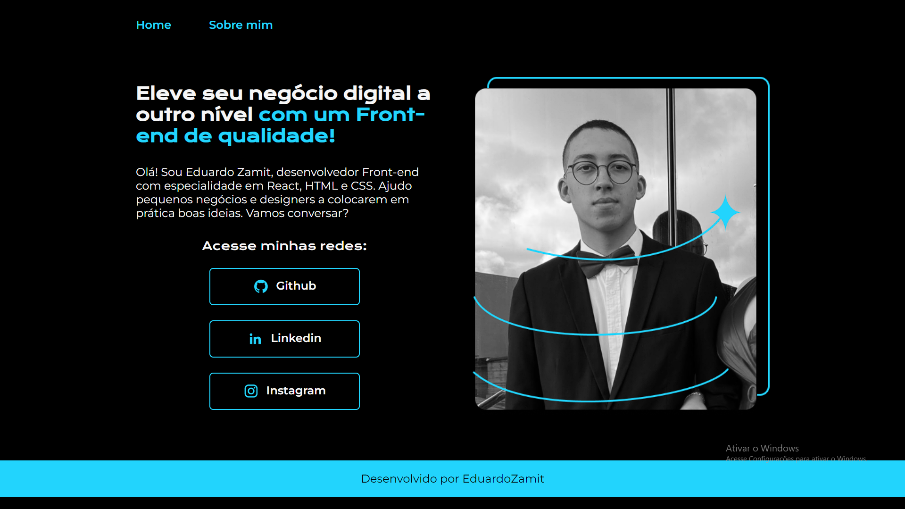
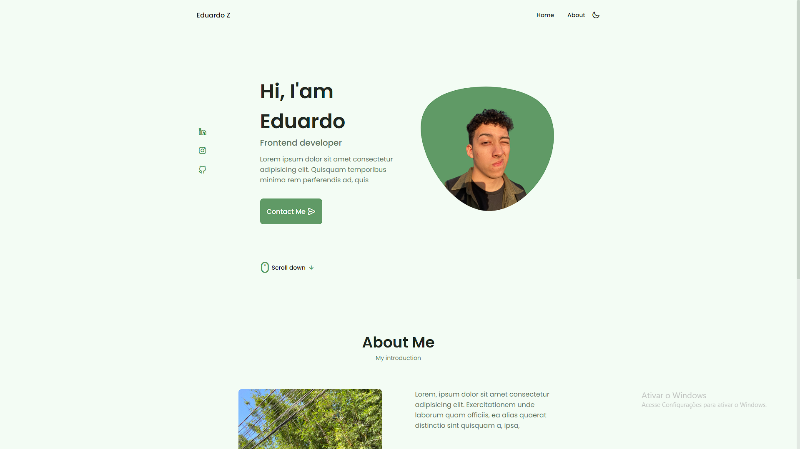

# Projeto de portfolio - NG

Olá pessoal, pra quem não me conhece eu me chamo Eduardo sou um estudante de desenvolvimento de software atualmente focado na área de frontend, tenho alguns meses de expêriencia e estou retomando meus estudos com renovado entusiasmo após uma breve pausa. 

## Sobre o projeto

Recentemente, iniciei uma nova experiência no Projeto Nova Geração do Instituto Caldeira. Como parte desse projeto, recebemos um plano de estudos na Alura, e durante o segundo módulo, focado em HTML/CSS, nos foi proposto um mini projeto de portfólio. No entanto, decidi ir além, aplicando meus conhecimentos e explorando tutoriais adicionais para criar um modelo mais avançado, incorporando também o terceiro módulo sobre JavaScript e manipulação do DOM.

É importante mencionar que já tinha estudado esses assuntos anteriormente, utilizando esse projeto como uma oportunidade para relembrar conceitos e refrescar minha memória. Espero que apreciem o resultado obtido!

### Projeto v.1 (seguindo as aulas):

#
### Projeto v.2:

#
